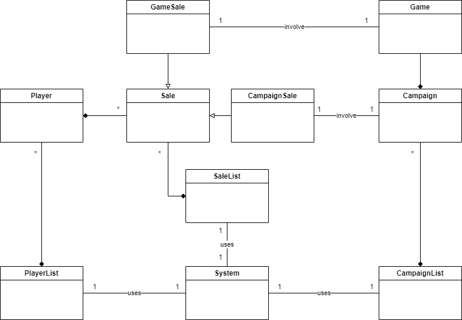

# İçerik
- 1. Ödev Tanımı
  - 1.1. Gereksinimler 
- 2. Çözüm
  - 2.1. Domain Model
  - 2.2. Açıklama

# 1. Ödev Tanımı
Bu yazılım için backend kodlarını JAVA ile geliştirmeyi planlıyoruz.  Yeni üye, satış ve kampanya yönetimi yapılması isteniyor. Nesnelere ait özellikleri istediğiniz gibi verebilirsiniz.  Burada amaç yazdığınız kodun kalitesidir. Ödevde gereksinimleri tam anlamadığınız durum benim için önemli değil, kendinize göre mantık geliştirebilirsiniz. Dediğim gibi kod kalitesiyle ilgileniyoruz şu an :)
## 1.1. Gereksinimler
- Oyuncuların sisteme kayıt olabileceği, bilgilerini güncelleyebileceği, kayıtlarını silebileceği bir ortamı simule ediniz.  Müşteri bilgilerinin doğruluğunu e-devlet sistemlerini kullanarak doğrulama yapmak istiyoruz. (E-devlet sistemlerinde doğrulama TcNo, Ad, Soyad, DoğumYılı bilgileriyle yapılır. Bunu yapacak servisi simule etmeniz yeterlidir.) (Loglama gibi)
- Oyun satışı yapılabilecek satış ortamını simule ediniz. ( Yapılan satışlar oyuncu ile ilişkilendirilmelidir. Oyuncunun parametre olarak metotta olmasını kastediyorum.)
- Sisteme yeni kampanya girişi, kampanyanın silinmesi ve güncellenmesi imkanlarını simule ediniz.
- Satışlarda kampanya entegrasyonunu simule ediniz.
- Ödevinizi Github’a yükleyiniz. Github linkinizi paylaşınız.

# 2. Çözüm
# 2.1. Domain Model
- <b>Attributeler sonradan eklenilmiştir, domain modelde sadece varlıklara odaklanılmıştır.</b>

## 2.2. Açıklama
- Gereksinimlere göre sınıflar unidirectional olacak şekilde ayarlandı, bunun sebebi toString metotlarında recursion hataları almamak için olmuştur. Örneğin bir sale bir playere ulaşabilir ama bir player bir saleye ulaşamaz.
- N-Tier mimarisine giriş amaçlı data katmanında yer alan bazı sınıflar yazılmıştır, bunlar entityler ve generic repositoryler olmuştur. 
- Entityler kalıtım yolu ile bir base sınıfının ID'sini almaktadır, bu ID generic tipinde tanımlandı, böylelikle farklı ID tipleri entegre edildi. 
- Generic repository bir arayüzdür, farklı teknolojilerin kullanılabileceği göz önünde bulundurarak yapıldı. Arayüzü uygulayan bir list generic repository var, alt yapısı listeden oluşur, arayüzün metotları implement etmektedir.
- Ödevin gereksinimlerine göre sadece ihtiyaç duyulan repository sınıfları tanımlandı. Bunlar PlayerRepository, SaleRepository ve CampaignRepository sınıflarıdır. 
- Ödev fazladan ayrıntı istemediği için Business Katmanı yapılmadı.
